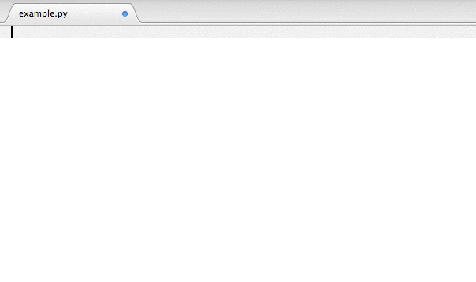

# Import Magic [](https://travis-ci.org/alecthomas/importmagic)

The goal of this package is to be able to automatically manage imports in Python. To that end it can:

- Build an index of all known symbols in all packages.
- Find unresolved references in source, and resolve them against the index, effectively automating imports.
- Automatically arrange imports according to PEP8.

It was originally written for the Sublime Text 2 [Python Import Magic](https://github.com/alecthomas/SublimePythonImportMagic) plugin.

## Example of use in Sublime Text 2 plugin




## Using the library

Getting index from cache:

```python
index = importmagic.SymbolIndex()
index.get_or_create_index(name='foo', paths=sys.path)
```

Build an index:

```python
index = importmagic.SymbolIndex()
index.build_index(sys.path)
with open('index.json') as fd:
    index.serialize(fd)
```

Load an existing index:

```python
with open('index.json') as fd:
    index = SymbolIndex.deserialize(fd)
```

Find unresolved and unreferenced symbols:

```python
scope = importmagic.Scope.from_source(python_source)
unresolved, unreferenced = scope.find_unresolved_and_unreferenced_symbols()
```

Print new import block:

```python
start_line, end_line, import_block = importmagic.get_update(python_source, index, unresolved, unreferenced)
```

Update source code with new import blocks:

```
python_source = importmagic.update_imports(python_source, index, unresolved, unreferenced)
```

For more fine-grained control over what symbols are imported, the index can be queried directly:

```python
imports = importmagic.Imports(index, python_source)
imports.remove(unreferenced)

for symbol in unresolved:
    for score, module, variable in index.symbol_scores(symbol):
        if variable is None:
            imports.add_import(module)
        else:
            imports.add_import_from(module, variable)
        break

python_source = imports.update_source()
```


### Configuration

Configuring import styles

1. Using `importmagic.Imports`.

```python
imports = importmagic.Imports.set_style(multiline='backslash', max_columns=80, indent_with_tabs=True)
```

`multiline` takes `backlslash` or `parentheses`.


2. From `setup.cfg`

Add configuration to setup.cfg

```python
[importmagic]
multiline = 'parentheses'
max_columns = 120
indent_with_tabs = 1
```

and pass root directory to importmagic

```python
imports = importmagic.Imports(root_dir='/foo/bar/')
```
